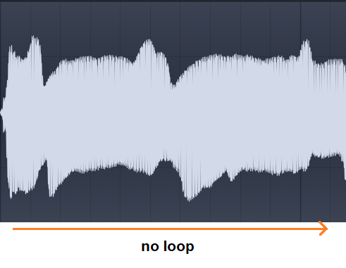
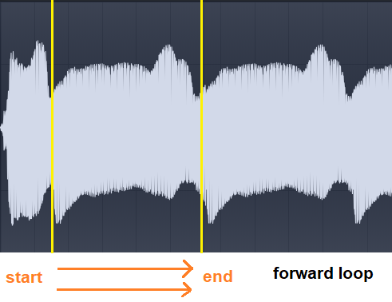
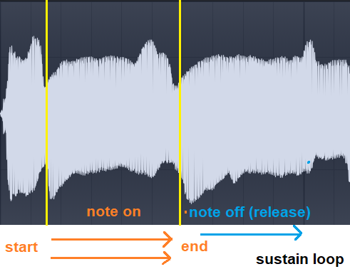
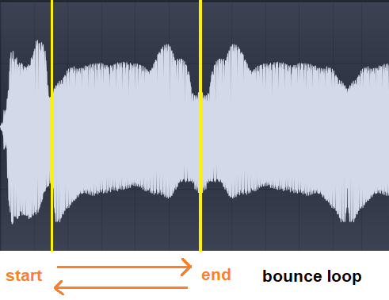

# Looping Behaviors

There are different ways to manipulate the behavior of looping, and I’m going to list all of them:

## No loop

Also referred as “one shot” or “disabled”. As it says, there’s no looping.
The sampler will straight play the sample until the sample ends.
Some samplers has "one shot" and "disabled" as different options because "one shot" is for play
the sample until it ends ignoring the amplitude envelope (it does not stop when the key is released)
while "disabled" you can use the amplitude envelope and you can stop the sample when the key is released.

## Forward

Also called [loop_continuous] in SFZ format, is where the sample has a determinate position for looping,
start-loop and end-loop. When the sample go to the end loop, it starts again on start loop,
and so on until the user stop playing the sample. When there’s release in the envelope,
the loop will still be going on.

## Sustain

Derivate of “forward” loop. The difference is when the release envelope is activated,
the sample stops looping and plays the rest of the sample data beyond end-loop. This is used as a way
to make “release” samples with looping a short empty/silence area of the sample at the start.

## Bounce

Also known as “ping-pong”, is when the sample go forward and then reverse and then forward
all over again inside of start-loop and end-loop. The rarest looping behavior because was used
for save memory and few samplers/romplers supports it. In this way you double the duration of the loop
when in binary data is half of it and it’s actually very hard to get a good loop without clicks in this way..

[loop_continuous]: https://sfzformat.com/opcodes/loop_mode/
