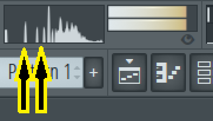

# Looping Ways: Freeze looping

The frozen loop is a form of looping where the sample (for the sake of redundancy) "freezes"
the frequencies in the loop area. What it does is to capture the frequencies to create
a periodical waveform with it.

For reference, this was done in early samplers, even in videogame consoles, like the Super Nintendo.

This can be done with different techniques, which I’m going to list them:

### 1. Raw loop

This technique is about to set a start-loop and end-loop without any processing to a certain waveform section of the sample. This can be hit or miss, the quality of the loop will be variant depending of the sample rate of the sample. The less is the sample rate, the more difficult is to get a good freeze loop.

A clear disadvantage for this technique is the loop sometimes will create harsh frequencies that can be annoying.

Another disadvantage is depending of the loop section; it will create additional frequencies.

<video width="560" height="315" controls>
  <source src="../assets/img/freeze/33i81g.mp4" type="video/mp4">
</video>

### 2. Raw loop + crossfade

It’s very similar to the first one, with the difference of set a periodical section of 2 or 4 cycles,
and applying a crossfade to blur the harsh frequencies. This also can be hit or miss,
but in this way you have more probabilities to get a good freeze loop.

The disadvantage of this is, again, sometimes it will create additional frequencies to the loop
or the frequencies will be slightly different to the rest of the sample.

<video width="560" height="315" controls>
  <source src="../assets/img/freeze/rmoxv8.mp4" type="video/mp4">
</video>

### 3. Celemony Melodyne

This software was made as a pitch correction tool. But also works as a fast, easy and convenient way
to create freeze loops to any sample! This is because when you import a sample to the program,
and you click it to a certain section, it will play the whole sample until the point you clicked,
and when it goes to the point, it generates a freeze loop. The exact thing we are looking for.
And the results are good! Remember to record the take and set the algorithm as "melodic", then,
with the sample editor, set the loop with a raw loop or combined with crossfade to the looped section
generated by Melodyne. The good news is for this you need the essential version, so,
no need to spend that much money for this function.

I recommend to experiment with different points in the sample,
to get the most appropriate loop for your needs.

<video width="560" height="315" controls>
  <source src="../assets/img/freeze/qj1ubl.mp4" type="video/mp4">
</video>

Now we know the different ways to do a freeze loop, but there’s a small issue:
the loop probably will be out of tune! This means the loop is detuned in comparison to the rest of the sample. Fortunately, this has a fix.

## How to tune a frozen looped sample

This part is relative easy, first, you need a tune reference, in my case, is the FL Studio’s oscilloscope,
where the wave gets static when is played in C, meaning the wave is in tune. Otherwise,
the wave will move to left or right. Now, with the reference, I try to tune the loop of the sample,
and we get the value for it, for example, +23 cents. Then, with that value, we go to the sample editor,
and we are going to select the whole sample except the loop zone, and in this section of the sample,
we are going to resample it to a certain fine pitch, which is going to be the opposite value
of the loop tune value, in this example, -23 cents. Apply the changes, and now,
the whole sample will be in tune when we tune it to +23 cents. Some cases this does not work, so,
with trial and error, instead of using the exact opposite value, we will try to do an approximation,
in this example, -29 cents, -32 cents… until we got the right value for it.

And that’s how you tune a sample with a frozen loop! Here a video demonstration of it:

<video width="560" height="315" controls>
  <source src="../assets/img/freeze/eqqinr.mp4" type="video/mp4">
</video>

And this is how you make a freeze looping.
