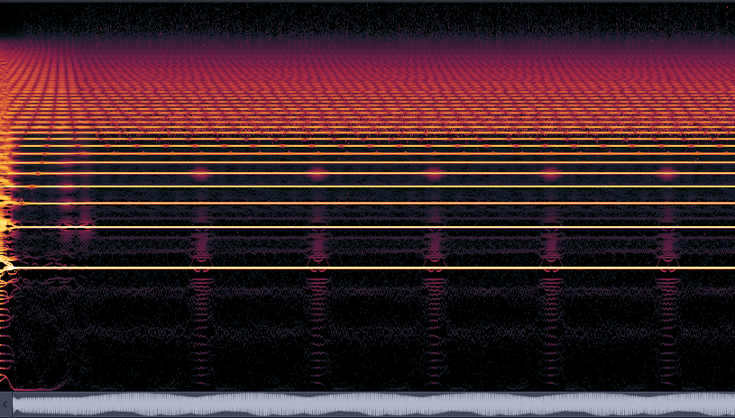
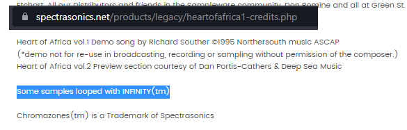
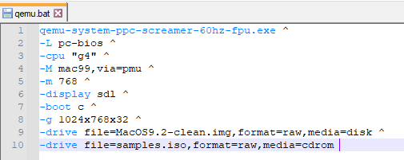
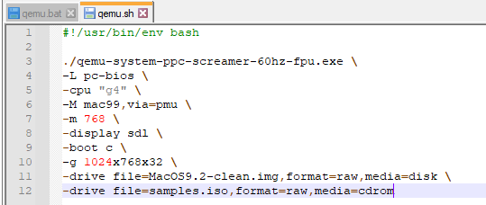
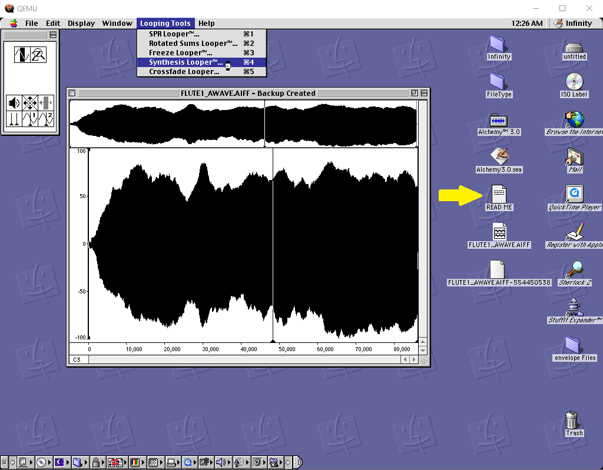

# ANTARES INFINITY: The (Almost) Lost Looping Tool

One day I extracted the samples of gm.dls (the default GM bank for Windows), and one of the samples
got me my attention and it’s this Sawtooth sample:

Looks weird, right? It starts as a normal sawtooth and then suddenly it’s a weird smooth shape.
This loop also has some static frequencies like the lower ones while the high frequencies
are in constant movement if you see it in a spectrum.

My mind was like “how they do this? This is not possible with a simple crossfade”,
and I notice other companies (Yamaha, Korg, to name a few) and sample library manufactures
had the same behavior with some samples, so I started to make a research about the looping tools
used by that time, which was around the 90s.

I remember Spectrasonics (founded by one of the most important people in Roland, Eric Persing)
mentioned about a tool called “Infinity” in one of their libraries, which was Heart of Africa 1.

I google it and I ended up with a review from an old magazine, but with an antique version for Macintosh,
I thought was a very old tool and hard to emulate, until I check a thread in a forum called Mac OS 9 Lives,
and this is where I got the tool. <http://macos9lives.com/smforum/index.php?topic=1635.0>

I realize I need a Mac OS 9 machine, I tried with Sheepshaver but I couldn’t run it,
so I had to use QEMU which fortunately, It worked. With trial and error I get it running, and finally,
I found the exact tool used by these corporations! And you can use it with your own samples.

## How to run

### 1. A build of the QEMU fork with audio support:

<https://gist.github.com/akemin-dayo/0e9bdcd74b2ad7f0bcf56e0680256103>

<video width="560" height="315" controls>
  <source src="../assets/img/infinity/phvzfp.mp4" type="video/mp4">
</video>

The build I used for Windows is this one:

<https://surfdrive.surf.nl/files/index.php/s/SS5gKHZrf1ykFuS/download>

and for macOS users:

<https://surfdrive.surf.nl/files/index.php/s/00rRe6m1a3K44BK/download>

### 2. Mac OS 9.2.1 hard disk image with Antares Infinity

This is provided by myself (2GB .img [Download from MEGA]), inside of this hard disk includes a READ ME
with instructions and indications. The way to configure it is with a bash/batch file,
since QEMU is executed via command lines.

For Windows, you can create a bat file like this:

samples.iso are the AIFF sample files you are going to import from your computer to Mac OS 9
stored as a ISO file. You can delete that line if you want to run only the hard disk.

For Bash (macOS/Linux):

Replace .exe with whatever executable you're using for your OS.

This batch/bash file must be in the same folder as the executable.

### 3. AIFF files with sample loop and sample root key information

This can be done with Awave Studio if you want to convert it from WAV to AIFF.
I didn't found free alternatives for this task unfortunately
(only converts from WAV to AIFF without loop/root key information).

### 4. Folder to ISO converter

There’s several ways to do this, use the one you find more comfortable.
With this you create a ISO file which includes the AIFF samples you want to import to Mac OS 9.

### 5. HFSExplorer

<https://www.catacombae.org/hfsexplorer/>

This is for exploring the Mac OS 9 hard disk and extract your AIFF samples made with Infinity
to use them in a modern DAW or sampler.

## Now you try!

I recommend to read the manual since it explains everything very well. But soon I will make articles making my own explanations and examples using the tools provided by Infinity.

MANUAL: <https://web.archive.org/web/20060108175322/http://www352.pair.com/anttech/downloads/Infinity_v3.18_manual.pdf>

Hope you enjoy this tool, see you later!

[Download from MEGA]: https://mega.nz/file/Y6on0T4D#9Dw-JUssRMaF9hAyMZrMccCh241dJPzsJ1JzGKsm-bU