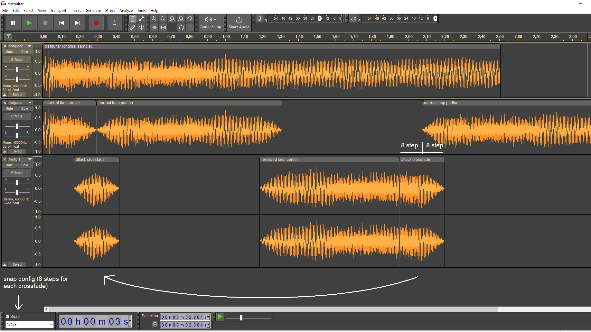
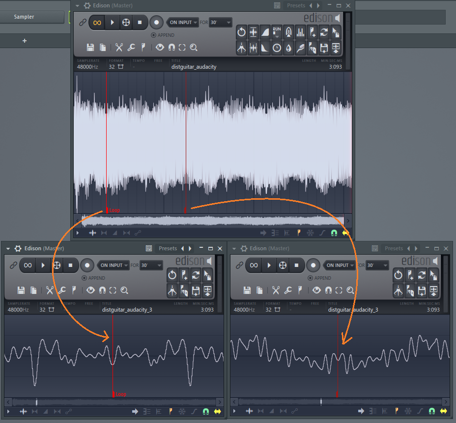
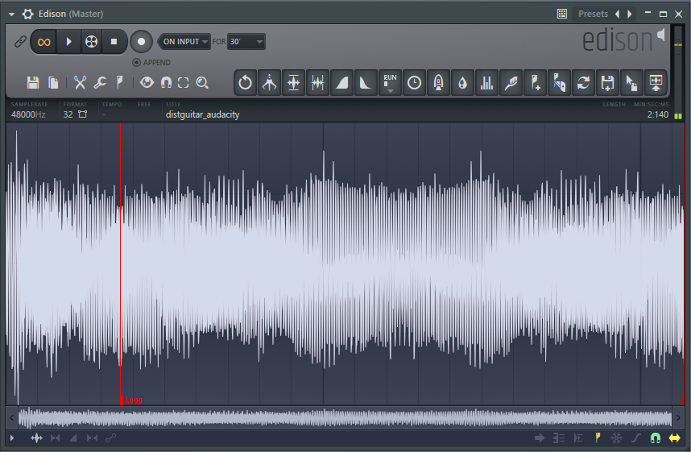

# Looping Ways: Ping Pong

Finally I figured out one kind of looping technique that seemed almost imposible to make,
the ping-pong loop.

This way of looping is useful for non-periodic samples that you could ruin them if you use other ways
(like crossfade) and also, if you want a smaller size of the sample while it last more longer
(in case if your sampler supports this looping behaviour).

Examples I saw using this way of looping are strings, distorted electric guitars,
brass section and etherial sounds.

This is used mostly by Roland since the Roland S-550 days, and unfortunately,
there’s no automatic tool that let you do this kind of procesing to your samples.
So, you have to do it manually.

You can use any audio editor or DAW for this, find the one that you feel more confortable to do this task.
I’m going to use Audacity. Before of anything, you have to make sure you have enabled some sort
of snap feature, in my Audacity is enabled with a bar of 1/128. This is for to have
a good time proportion between crossfades.

Now, you need a sample, my case is this distorted guitar sample.

Select the section you want to loop and split it, you will have your attack sample and the loop sample.

Next, insert a new channel and copy this loop, reverse it and then crossfade it with the original loop
(this crossfade should have a curve, in Audacity, is Effect -> Steve Daulton -> Crossfade Tracks,
then Fade Type: Constant Power 1 and Custom Curve: 1.0).

After that, copy the original loop at the end of the reversed loop and crossfade it again. And last,
split this last section between the reversed and normal loop and copy it to the attack sample,
and apply a crossfade between the attack of the sample and the normal loop.

Why we have to do this crossfade at the attack of the sample? Because if you don’t do this,
your loop is going to start very late in the sample, and we don’t want that if we want to save memory
(the loop should start close to the start of the sample itself).

Play your sample and it should sound good. Export it as WAV and you’re ready for the next stage!

In your sample editor, search for the mirrored waveforms, you will find one at the start of the sample
and another at the end of the sample. Here is where you have to set the start-loop and end-loop.
It must be right in the middle as possible, like a mirrored image
(if the sample points are odd, even better).

If you play this, normally it will play as a foward loop. So, go to your options or sampler
loop options and set it to ping-pong or bounce. Now you are listening to it as intended.
And if you see your sampler, the line where plays the sample through the waveform,
it does the ping-pong move!

But what if your sampler doesn’t support it? If you don’t care about size, you can copy the loop zone,
paste it next to the original loop, reverse it. Now this ping-pong loop works with foward looping!

The results; first the original sample, then the ping-pong looped one:

<video width="560" height="315" controls>
  <source src="../assets/img/pingpong/0jo2pn.mp4" type="video/mp4">
</video>

And this is how you do a proper ping-pong loop with samples, now it’s your turn!
