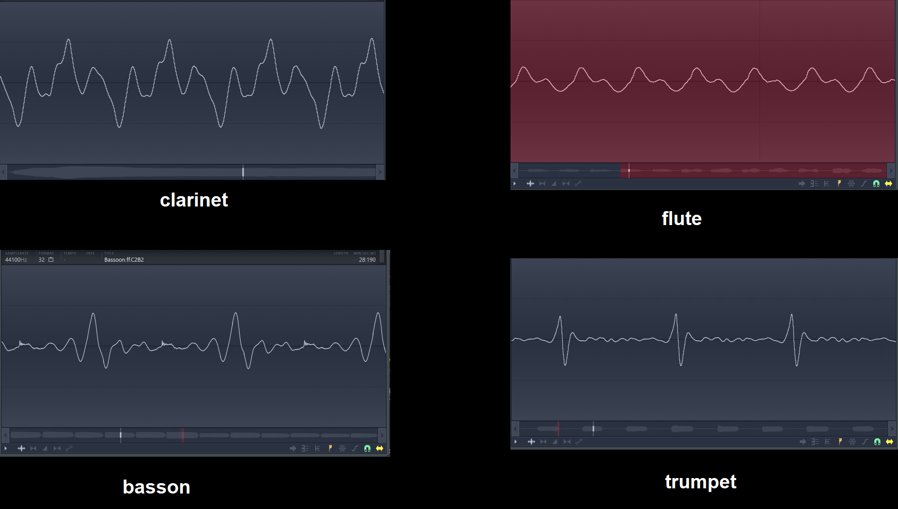
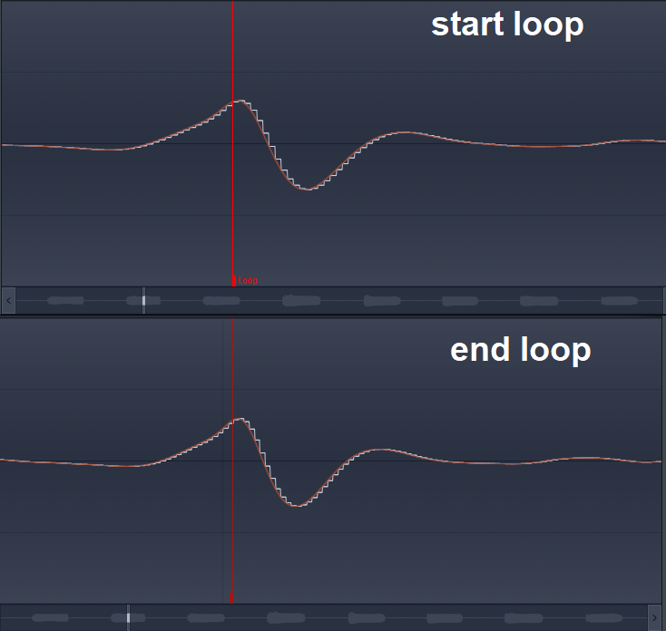

# Looping Ways: Raw looping

Raw looping is a way of loop where you just set a loop-start and a loop-end without any audio processing.

This type of loop works pretty well with periodical samples
(samples that has a certain repetitive and consistent waveform on them) which makes easier to use
this kind of looping. These could be simple synth waveforms, non-vibrato solo brass,
woodwinds and strings (violin/cello/viola/contrabass), and so on.

The start-loop and end-loop should have the same or similar sample point to make it work, otherwise,
it will click. For this, you have to choose which point of the waveform pattern that you will set
for start-loop, and based on that, you search for the end-loop having the same or similar characteristics.

Depending of the section, the loop will not be noticeable. Because if you loop a section of the sample
(for example, a woodwind), where the player blows inconsistently, you will notice the loop even
if there’s no clicks on it.

<video width="560" height="315" controls>
  <source src="../assets/img/raw/ykfww4.mp4" type="video/mp4">
</video>

<video width="560" height="315" controls>
  <source src="../assets/img/raw/wsd9p1.mp4" type="video/mp4">
</video>

And this is how you make a raw looping!
