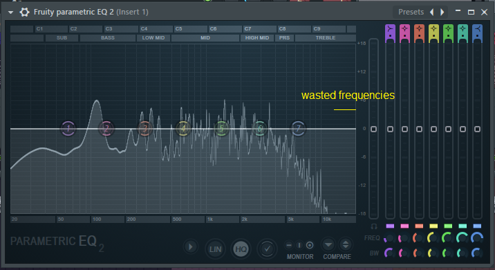
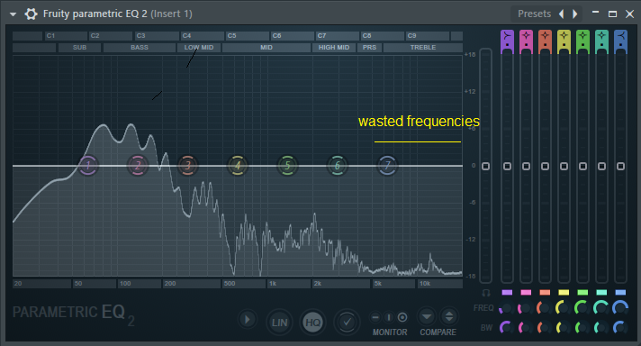
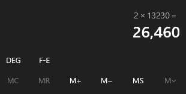
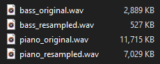

# How to save/free up space with samples using sample rate

If you are a music producer, “samplist” or a nerd/geek of music gear/technology,
probably you know about sample rate. I’m going to assume you already know what it is,
and if you want to know it, here a good explanation about it: <https://www.izotope.com/en/learn/digital-audio-basics-sample-rate-and-bit-depth.html>

For most people, they believe sample rate only are the standard ones, like 22050, 32000, 44100, 48000…

I’m not going into details because is not necessary in this case, but you should know that these standards
are actually specifically designed for certain mediums and circumstances.
One of them is for recording and processing like audio engineers who does mixing to reduce distortion,
that’s why they use 88200 or 96000Hz. For CD format is 44100 because it’s proportional to 25FPS (PAL)
and 30FPS (NTSC). Similar thing with 48000 for DVDs, digital TV and so on.

As you can see, these sample rates are like this because of the medium. But what about samplers or synths?
Well, in this case they don’t need a standard sample rate for the samples.
Yes, they do have a standard sample rate output just like anything that has a DAC,
but for the sample playback doesn’t matter.

Originally, the way samplers pitch the samples to certain notes,
is with changing the sample rate playback of the sample based on their original sample rate.
For example, if the sample rate of the note C4 is 44100, and I want a 1+ semitone up,
what the sampler does is change that 44100 sample rate to 46722 with a math formula

[new-sample-rate = Math.Pow(2.0, (semitones / 12.0 )) * original-samplerate]

and now it sounds like C#4. This is how old samplers like Fairlight CMI works. For modern samplers,
it uses a similar approach with added interpolation.

This is the reason why the sample rate doesn’t matter for sample playback,
it will always work with non-standard sample rates,
and this is good because we can reduce the size of our samples with resampling.

When the lower is the sample rate, the lower is the range of high frequencies can take.
And for samples where there’s no important high frequencies, you’re wasting sample rate with it.
For example, this happens with instruments in low notes, such as Piano or Bass:

You have to do resampling to cut these frequencies. To make an accurate resampling,
you have to use the formula:

[sample-rate = 2 * maximum-frequency]

In maximum frequency you write the maximum frequency you need for the sample, it can be 4015 or 13230.
You can check this in your DAW with any plugin that has a spectrum analyzer.
Press Calculate and you will get the exact sample rate that will cut to that certain frequency you specified.

Write that sample rate into your resampler and Voilà! You optimized a sample. If you resample the sample, you realize that now the sample is lightweight because it stores less sample points in the file for the same sound. This depends of how much frequencies you’re going to cut.

NOTE: Do this resampling BEFORE of making a loop,
because you will ruin your loop if you resample it after looping.

This technique was used by E-MU Systems for the Proteus line and their sequels.
They used a lot of custom sample rates for the samples to optimize the used space in memory.

Now it’s your turn! Try to optimize your samples with this technique in your tiny memory samplers.

The resampling software I recommend and it's free is Audacity.
Go to Edit -> Preferences -> Quality -> Sample Rate Converter -> Select "Best Quality (Slowest)"
and now you have a high quality resampling for your samples!

Another free alternative is SoX Resampler (soxr) included on ffmpeg.

See ya!
