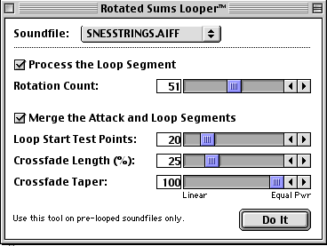
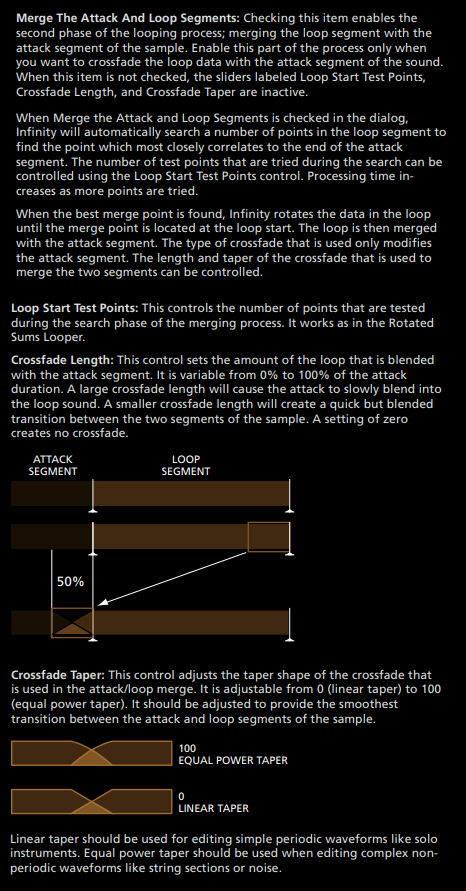

# Looping Ways: Rotate Sums looping

This is another loop tool from Antares Infinity ([click here] if you don't have it),
and it’s interesting because it could be a good alternative to crossfade.

What it is this “Rotate Sums” thing? Basically it’s distributing random irregularities throughout the loop. This type of loop works for non-periodic samples (strings, chorus, synths stacks, noise, etc).

And what’s the advantage of this looping way? Unlike crossfade, this one doesn’t change the size of the loop start-end. This means we can preserve the duration of the loop, instead of making it shorter like the crossfade. So, this is useful when we have limited memory and the size of the samples matters.

Here a little demo of it: first, it’s the sample with a raw loop, second, the sample using crossfade, and finally, the sample using rotate sums.

<video width="560" height="315" controls>
  <source src="../assets/img/rotatesums/og43u8.mp4" type="video/mp4">
</video>

Now I’m going to explain the controls of this tool.

BEFORE of using this, we have to make sure our sample does not have clicks in the loop.
A simple fix of this could be to add a little crossfade just to make it disappear. After that,
we can use the tool, and it’s very simple: we only have a rotation count.
We have to experiment the different values until we get a coherent result for our sample, so,
pay attention of how the loops sounds.

And then we have the “Merge Attack and Loop Segments” controls which are just how we fade the start
of the original sample with the generated loop to have a coherent transition between the two.

And this is how to use Rotate Sums Looper, now it’s your turn, and experiment this tool with your samples!

[click here]: infinity.md
