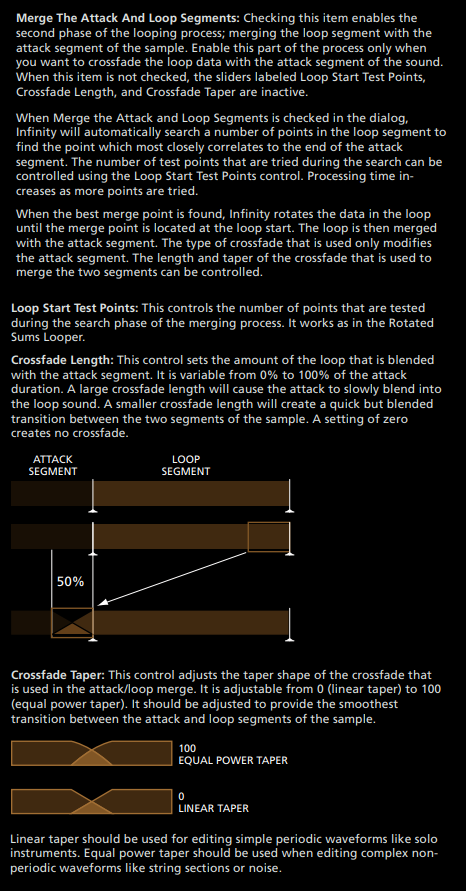

# Looping Ways: Synthesis looping

This is one of the most interesting looping tool out there, because this solves a big issue
with crossfade looping: not all frequencies are consistent.

When you do a crossfade loop, the frequencies may vary, you can spot a harmonic in common
during the crossfade but only that harmonic in specific, the rest of harmonics of the sample
won’t be consistent and will bounce the gain of each. And it’s painful to spot the exact frequency we want.

To illustrate this, I have this piano sample, piano samples are a pain when it comes to loop them.
First is the original without loop, second is the same piano but looped with crossfade and third
is the same piano but looped with synthesis looper (with the right configuration of course).

<video width="560" height="315" controls>
  <source src="../assets/img/synthesis/vdk8w7.mp4" type="video/mp4">
</video>

As you can see and hear, for synthesis looper, the gain inconsistencies are gone,
and makes the sample very pleasant to use in any pitch.

Then, how I use this synthesis looper?

Go to Antares Infinity: [click here] if you don't have it. When you select synthesis looper,
this window is open. You have a lot of controls but the most important ones are these:

We have 2 zones, the first and second one. The first one can be specify where it ends the zone
(the exact frequency) and the second one where it starts the zone. We can’t specify the frequency
value for the second one unfortunately, so we have to guide us based on the GUI.

Each one has their own Sidelobe Width (% x 10) which graphically it’s represented as the height.
What it does this “% x 10” thing? Basically, it’s how much “static/periodic” or “diverse/non-periodic”
is the sound of the zone. When the height is high, you will get a “chorused” sound from it.
If the height is low or zero, then you will get a “freeze” sound from it. Of course, both based
on the frequencies you are covering.

And then we have the fade size between the zones, for better blur of each different sounds of the zones.

Retain Noise % means of how much floor noise we want in the loop to match the floor noise
from the original sample, this is for make the loop sound natural and coherent with the start
of the original sample (the attack).

Illustrated in a modern visualization, it’s like this:

Remember to assign a MIDI NOTE value to the sample, this can be perfectly taken from the sample metadata
if you already did it when you saved the sample or you can assign it at [Edit -> Set MIDI Note]
if you forgot to do it (as reference, the middle C it’s C3 in this program).

This is important because this helps to indicate which frequency note is the fundamental, the base one.
For example, if the sample it is C4, midi note 60, then the fundamental frequency is 261.6256Hz
and the rest of generated frequencies will be coherent with the timbre of the sample.

And last we have the “Merge Attack and Loop Segments” controls which are just how we fade the start
of the original sample with the generated loop to have a coherent transition between the two.

With this you can have a very organic loop with little memory, of course, it won’t sound 100% natural
as the original but it’s the best choice for instruments with a lot of inconsistency and variations
that makes very difficult to get a good result using other looping ways, like pianos.

Now you try! Dominate the tool and make “magic” with that like Roland!

[click here]: infinity.md
